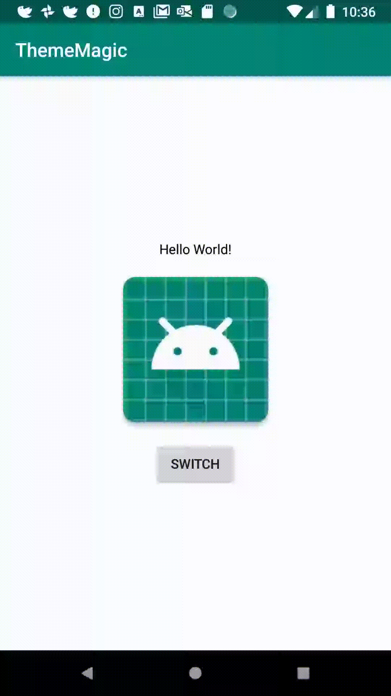

# AndroidThemeMagic
Automatic multiple theme support for Android Apps. It is a magic!!

## Demo



## Goal

Android SDK doesn't support switching theme dynamically without restarting activity. This project targets to build framework to support that. The basic idea is to hold all views which need to apply new property when theme changes. And the views are able to locate their corresponding resource values against different themes. Also for the framework, it should be easy to extend more themes.

## A Basic Example

For developers who needs to add theme support for their custom view or acitivies, it's very easy to leverage the theme framework. In most cases, the only thing need to be done is adding some additional theme resource in the corresponding locations. Let's start from a very basic example. In this case, we need to change the text color for a TextView.

1. Make your activity extend `ThemeCompatActivity`. Or you can declare `ThemeComaptDelegate` as property of your activity instead.
    ```Java
    public class ExampleActivity extends ThemeCompatActivity {
        ...
    }
    ```
2. Define a `TextView` on in your layout xml and set a `textColor` with a color reference for it.
    ```xml
    ...
    <TextView
        ...
        android:textColor="@color/theme_color"/>
    ...
    ```
3. Declare related color resources in `res/values/color.xml`. The name of the corresponding color should match theme definition in codebase.
    ```xml
    <color name="theme_color">#80000000</color>
    <color name="theme_color_dark">#FFFFFFFF</color>
    ```
    > Here you will find a **theme_color_dark** which we don't have an explicit reference in layout xml. We name the color based on theme definition in codebase as below.
    > ```Java
    > public enum Theme {
    >     Default(),
    >     Dark("_dark");
    >
    >     private String mSuffix = null;
    >
    >     Theme() {
    >     }
    >
    >     Theme(String suffix) {
    >         mSuffix = suffix;
    >     }
    >
    >     String getSuffix() {
    >         return mSuffix;
    >     }
    > }
    > ```
    > The `Dark` theme has a suffix `_dark`. Names of xml resources should match the suffix for the corresponding theme.

    Congutulations! So far, you have done every thing to support theme changes for the `TextView`.

## Supported xml attributes

In the previous section, we introduced how to apply theme for a `TextView` defined in xml. For other views, we also support other resource references. As an example, you can define background for a `LinearLayout`.

```xml
<LinearLayout
    ...
    android:background="@drawable/background"/>
```

Also you could have both a background.(png|xml) and a background**_dark**.(png|xml) in the drawable folders.

For now, this project haven't support for all attributes defined in Android SDK. So far, we have supported attributes below. If you define resource references in the below list, you don't need to write extra logic code to support themes.

    * textColor
    * textColorHint
    * background
    * backgroundTint
    * src
    * tint
    * buttonTint

## Views not defined in Layout XML file

Besides the xml files, sometimes we want to create views for the existing view container. In this case, theme manager won't work automatically since it doesn't know the existence of these views. In this case, we should add the views manually in Java code. We can do it this way.

```Java
ThemeManager.getInstance().addAndroidThemeView(view, android.R.attr.textColor, R.color.theme_color);
```

For concrete usage, please refer to the code implementation.

## Dynamically change window background

Some activities will use window background defined in the style rather than the content background defined in xml. For this case, if you want to change the window backgournd dynamically. You could override the `getDefaultWindowBackgroundId()` in your activity.

```Java
public class ExampleActivity extends ThemeCompatActivity {
    ...

    @Override
    public int getDefaultWindowBackgroundId() { return R.color.default_window_background_color; }

    ...
}
```

## Apply different styles for themes

For some views especially some popups, we don't define their layouts our own. Android SDK had embeded their resource files into system already. If we need to apply themes for these views. The covinient way is to define the styles for them. If you have different styles for themes, you need to override `getThemeStyleId(Theme theme)` to implement that. In the base class, we have a default implementation.

```Java
protected int getThemedStyleId(Theme theme) {
    switch (theme) {
        case Dark:
            return R.style.DarkThemeStyle;
        case Default:
            return R.style.LightThemeStyle;
        default:
            return 0;
    }
}
```

And you can find its declaration in `src/chrome/android/java/res/values-v(16|21)/styles.xml` as below.

```xml
<style name="LightThemeStyle">
    <item name="alertDialogTheme">@style/AlertDialogTheme</item>
    <item name="android:alertDialogTheme">@style/AlertDialogTheme</item>
    <item name="android:colorBackground">@color/dialog_background_color</item>
    <item name="android:colorForeground">@color/control_foreground_color</item>
    <item name="android:colorPrimary">@color/default_primary_color</item>
    <item name="android:textColorPrimary">@color/default_text_color</item>
    <item name="android:textColorSecondary">@color/abc_secondary_text_material_light</item>
    <item name="android:textColorPrimaryDisableOnly">@color/default_text_color</item>
    <item name="android:textColorHint">@color/abc_hint_foreground_material_light</item>
</style>

<style name="DarkThemeStyle">
    <item name="alertDialogTheme">@style/AlertDialogThemeDark</item>
    <item name="android:alertDialogTheme">@style/AlertDialogThemeDark</item>
    <item name="android:colorBackground">@color/dialog_background_color_dark</item>
    <item name="android:colorForeground">@color/control_foreground_color_dark</item>
    <item name="android:colorPrimary">@color/default_primary_color</item>
    <item name="android:textColorPrimary">@color/default_text_color_dark</item>
    <item name="android:textColorSecondary">@color/abc_secondary_text_material_dark</item>
    <item name="android:textColorPrimaryDisableOnly">@color/default_text_color_dark</item>
    <item name="android:textColorHint">@color/abc_hint_foreground_material_dark</item>
</style>
```

## Views don't apply theme

In some special cases, we need to add exception for a view that doesn't need to apply theme at all. For views defined in xml, we can add an additional tag `supportTheme` in its property.

```xml
<ExampleView
    xmlns:android="http://schemas.android.com/apk/res/android"
    xmlns:app="http://schemas.android.com/apk/res-auto"
    ...
    app:supportTheme="false"/>
```

## Non-View classes

For other classes which need to do things other than changing its view for different themes, we can just implement `ThemeItem` and add it to `ThemeManager` in its constructor. Then we can put our own logic in `void applyTheme(Theme)`. `ThemeManager` only hold a weak reference to the object. So don't worry about memory leak here.

```Java
public class CustomThemeClass implements ThemeItem {

    public CustomThemeClass() {
        ...
        ThemeManager.getInstance().addThemeItem(this);
    }

    public void applyTheme(Theme theme) {
        // Your own logic against theme changes.
    }

}
```

## Known issue

If you need to inflate a layout for a fragment in [onCreateView(LayoutInflater, ViewGroup, Bundle)](https://developer.android.com/reference/android/support/v4/app/Fragment.html#onCreateView(android.view.LayoutInflater,%20android.view.ViewGroup,%20android.os.Bundle)) with the parameter inflater, the fragment won't apply theme automatically for Android 7.0 devices. This seems a bug of the Android SDK and Android 8.0 has fixed this. The workaround of this issue is not to use the inflater paased into this method. Use below method to get the correct inflater.

```Java
LayoutInflater contextInflator = LayoutInflator.from(getContext());
```
